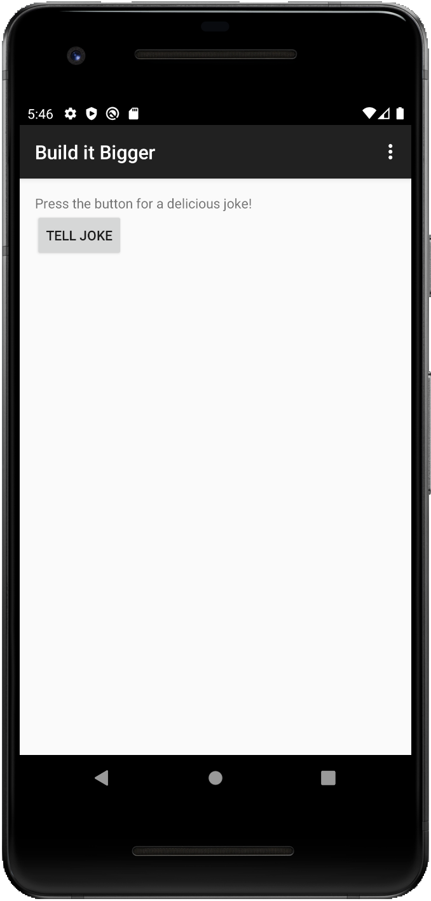
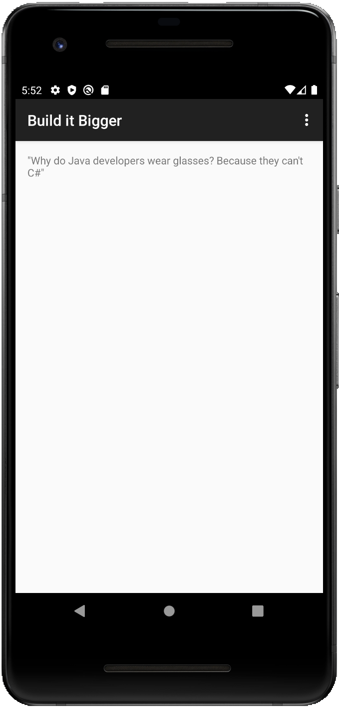

# Udacity - BuilditBigger

## Overview:
An Application has [product-flavors](https://developer.android.com/studio/build/build-variants), tells a [joke](https://cloud.google.com/endpoints) and shows [advertising](https://developers.google.com/admob/android/interstitial).

   
 
## Join development!

**Build status:** master  stable 

**Start contributing:** Make sure you read [SETUP.md](https://github.com/owncloud/android/blob/master/SETUP.md) when you start working on this project. Basically: Fork this repository and contribute back using pull requests to the master branch.

**License:** [GPLv2](https://github.com/josefdeutsch/udacitybuilditbigger/blob/master/LICENSE.txt)
