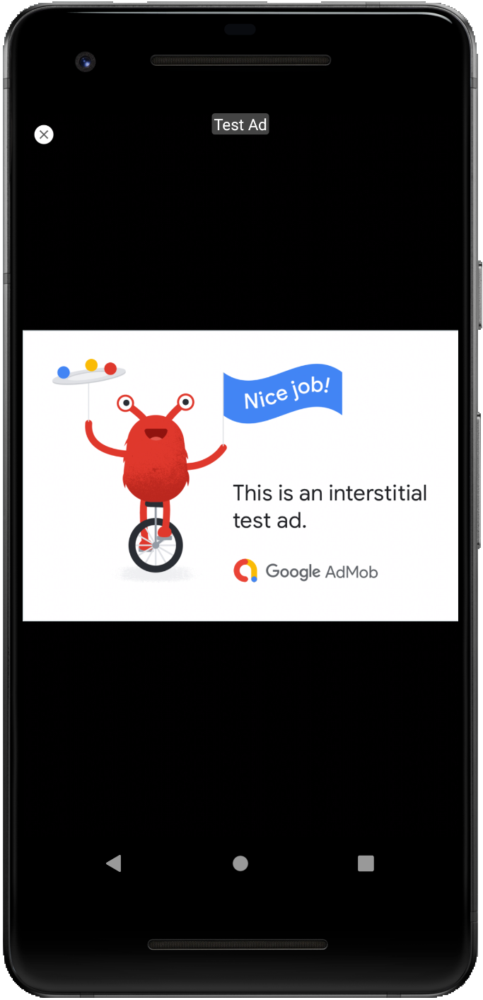

# Udacity - BuilditBigger

A simple app that tells jokes. Building it bigger with Gradle. 

# Objective

To learn the role of Gradle in building Android Apps and how to use
Gradle to manage apps of increasing complexity.
To also learn to:

* Add free and paid flavors to an app, and set up your build to share code between them
* Factor reusable functionality into a Java library
* Factor reusable Android functionality into an Android library
* Configure a multi project build to compile your libraries and app
* Use the Gradle App Engine plugin to deploy a backend
* Configure an integration test suite that runs against the local App Engine development server

# End Result

* The finished app will consist of four modules.
  * A Java library that provides jokes,
  * A Google Could Endpoints(GCE) project that serves those jokes,
  * An Android Library containing an activity for displaying jokes,
  * An Android app that fetches jokes from the GCE module and passes them to the Android Library for display

   
 
## Join development!

**Build status:** master  stable 

**Start contributing:** Make sure you read [SETUP.md](https://github.com/owncloud/android/blob/master/SETUP.md) when you start working on this project. Basically: Fork this repository and contribute back using pull requests to the master branch.

**License:** [GPLv2](https://github.com/josefdeutsch/udacitybuilditbigger/blob/master/LICENSE.txt)
